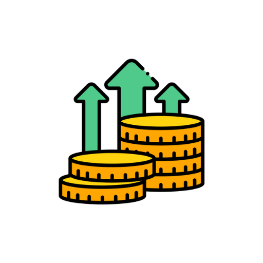

# 💰 BudgetTracker

A comprehensive personal finance management app built with Flutter that helps users track their income, expenses, and savings goals with a beautiful, modern interface.


## ✨ Features

### 🏠 Dashboard

- **Real-time Overview**: Track your total income, expenses, and net balance
- **Wallet Management**: Multiple wallet support with individual balances
- **Quick Actions**: Easy access to add expenses, manage wallets, and set goals
- **Recent Transactions**: View your latest income and expense entries

### 💵 Income & Expense Tracking

- **Income Management**: Add various income sources (salary, freelance, investments)
- **Expense Categorization**: Organize expenses by categories and types
- **Transaction History**: Complete record of all financial transactions
- **Wallet Integration**: Link transactions to specific wallets

### 🎯 Savings Goals

- **Goal Setting**: Create and track multiple savings goals
- **Progress Monitoring**: Visual progress tracking with daily targets
- **Goal Categories**: Different types of financial goals
- **Achievement Tracking**: Monitor completed and ongoing goals

### 📊 Reports & Analytics

- **Visual Charts**: Interactive pie charts and bar graphs
- **Spending Patterns**: Analyze your spending habits over time
- **Income Analysis**: Track income trends and sources
- **Budget Insights**: Smart financial recommendations

### ⚙️ Settings & Data Management

- **Data Export**: Download your financial data
- **Data Import**: Restore data from backups
- **App Customization**: Personalize your experience
- **Privacy Controls**: Complete data privacy and security

## 🚀 Key Features

- **📱 Offline First**: Works completely offline with local SQLite database
- **🔒 Privacy Focused**: All data stored locally on your device
- **🎨 Modern UI**: Beautiful Material Design 3 interface
- **📈 Real-time Updates**: Instant UI updates with Provider state management
- **🔄 Data Persistence**: Data survives app restarts and updates
- **📊 Rich Analytics**: Comprehensive financial insights and reports

## 🛠️ Technical Stack

- **Framework**: Flutter 3.7.2+
- **Language**: Dart
- **Database**: SQLite (sqflite)
- **State Management**: Provider
- **Charts**: fl_chart
- **UI Components**: Material Design 3
- **File System**: path_provider
- **Animations**: Flutter Animations + Lottie

## 📱 Screenshots

<div align="center">
  
  <p><em>BudgetTracker - Your Personal Finance Companion</em></p>
</div>

## 🏗️ Project Structure

```
lib/
├── main.dart                    # App entry point
├── models/                      # Data models
│   ├── goal.dart               # Savings goal model
│   ├── income.dart             # Income model
│   └── wallet.dart             # Wallet model
├── screens/                     # UI screens
│   ├── main_navigation_screen.dart  # Bottom navigation
│   ├── dashboard_screen.dart   # Main dashboard
│   ├── reports_screen.dart     # Analytics & charts
│   ├── bills_screen.dart       # Bills & reminders
│   ├── settings_screen.dart    # App settings
│   ├── wallet_screen.dart      # Wallet management
│   ├── goals_screen.dart       # Savings goals
│   └── income_screen.dart      # Income tracking
├── services/                    # Business logic
│   ├── budget_provider.dart    # State management
│   └── database_helper.dart    # SQLite operations
├── theme/                       # App theming
│   └── app_theme.dart          # Color scheme & styles
├── utils/                       # Utilities
│   ├── error_handler.dart      # Error handling
│   └── logger.dart             # Logging system
└── widgets/                     # Reusable widgets
    └── goal_card.dart          # Goal display widget
```

## 🚀 Getting Started

### Prerequisites

- Flutter SDK (3.7.2 or higher)
- Dart SDK
- Android Studio / VS Code
- Android device or emulator

### Installation

1. **Clone the repository**

   ```bash
   git clone https://github.com/BimRochee/BudgetTracker.git
   cd BudgetTracker
   ```

2. **Install dependencies**

   ```bash
   flutter pub get
   ```

3. **Run the app**
   ```bash
   flutter run
   ```

### Building for Production

**Android APK:**

```bash
flutter build apk --release
```

**iOS (macOS required):**

```bash
flutter build ios --release
```

**Web:**

```bash
flutter build web --release
```

## 📊 Database Schema

The app uses SQLite with the following tables:

### Goals Table

```sql
CREATE TABLE goals(
  id INTEGER PRIMARY KEY AUTOINCREMENT,
  title TEXT NOT NULL,
  targetAmount REAL NOT NULL,
  currentAmount REAL NOT NULL,
  durationDays INTEGER NOT NULL,
  startDate TEXT NOT NULL,
  endDate TEXT NOT NULL,
  dailyGoal REAL NOT NULL,
  status TEXT NOT NULL
)
```

### Income Table

```sql
CREATE TABLE income(
  id INTEGER PRIMARY KEY AUTOINCREMENT,
  source TEXT NOT NULL,
  amount REAL NOT NULL,
  category TEXT NOT NULL,
  walletId TEXT NOT NULL,
  date TEXT NOT NULL,
  description TEXT NOT NULL,
  type TEXT NOT NULL
)
```

## 🔒 Privacy & Security

- **Local Storage**: All data is stored locally on your device
- **No Internet Required**: App works completely offline
- **Private Database**: SQLite database in app's private directory
- **No Data Collection**: We don't collect or transmit any personal data
- **Export Control**: You control when and how to export your data

## 🎨 Customization

The app features a beautiful color scheme with:

- **Primary Colors**: Deep purple and indigo gradients
- **Accent Colors**: Warm orange and soft pink
- **Status Colors**: Green for income, red for expenses
- **Modern UI**: Material Design 3 components

## 📱 Supported Platforms

- ✅ **Android** (API 21+)
- ✅ **iOS** (iOS 11.0+)
- ✅ **Web** (Progressive Web App)
- ✅ **Windows** (Desktop)
- ✅ **macOS** (Desktop)
- ✅ **Linux** (Desktop)

## 🤝 Contributing

Contributions are welcome! Please feel free to submit a Pull Request.

1. Fork the repository
2. Create your feature branch (`git checkout -b feature/AmazingFeature`)
3. Commit your changes (`git commit -m 'Add some AmazingFeature'`)
4. Push to the branch (`git push origin feature/AmazingFeature`)
5. Open a Pull Request

## 📄 License

This project is licensed under the MIT License - see the [LICENSE](LICENSE) file for details.

## 🙏 Acknowledgments

- Flutter team for the amazing framework
- Material Design for the beautiful UI components
- SQLite for reliable local storage
- The open-source community for inspiration

## 📞 Support

If you have any questions or need help, please:

- Open an issue on GitHub
- Check the documentation
- Contact the development team

---

<div align="center">
  <p>Made with ❤️ using Flutter</p>
  <p>© 2024 BudgetTracker. All rights reserved.</p>
</div>
